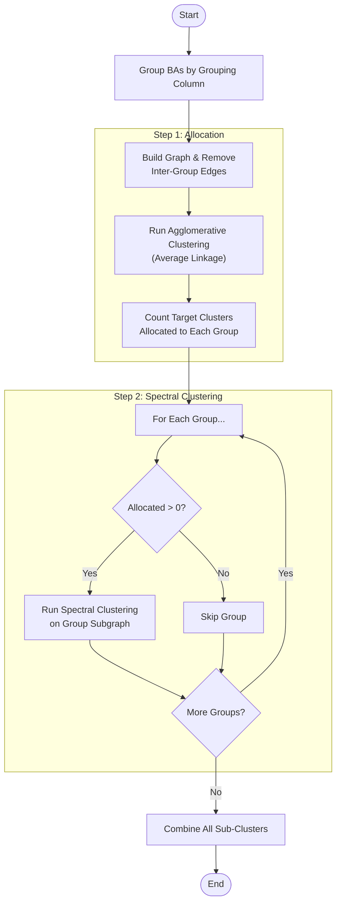
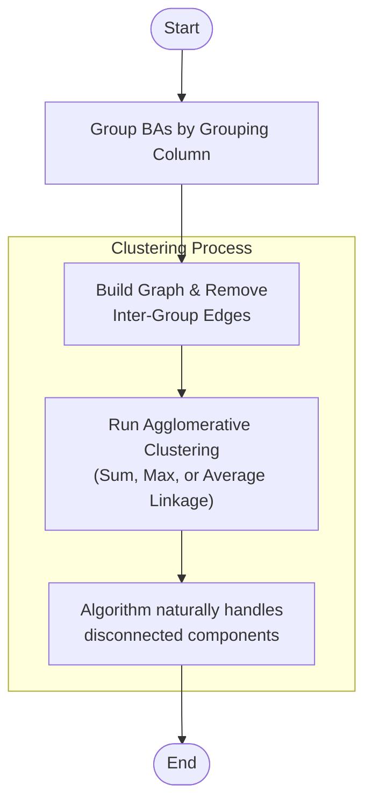
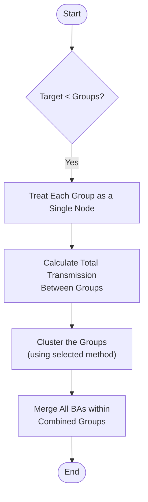

# PowerGenome Design Wizard

This repository contains a comprehensive web-based interface for building complete PowerGenome settings files. The wizard guides users through defining model regions, configuring resources, selecting fuel scenarios, and exporting ready-to-use configuration files for energy system modeling (specifically PowerGenome/GenX). The application runs entirely in the browser via PyScript.

**[Full Documentation](https://gschivley.github.io/PowerGenome-tools/)**

## Web Application

The PowerGenome Design Wizard is a 6-step interface that walks users through the entire process of configuring a PowerGenome model:

1. **Regions** - Select Balancing Authorities and cluster them into model regions
2. **Model Setup** - Define planning years and financial parameters
3. **Existing Plants** - Cluster existing generators within regions
4. **New Resources** - Select new-build technologies from NREL ATB and define custom resources
5. **Fuels** - Choose fuel price scenarios
6. **Export** - Generate and download complete settings YAML files

Use [PowerGenome Design Wizard](https://gschivley.github.io/PowerGenome-tools/web/) online or run it locally as described below.

### Running Locally

<details>
  <summary>Click to expand</summary>

Since the app uses PyScript and fetches local data files, it must be served via a local HTTP server to avoid CORS errors.

1. Navigate to the `web` directory:

   ```bash
   cd web
   ```

2. Start a simple Python server:

   ```bash
   python -m http.server 8000
   ```

3. Open your browser to `http://localhost:8000`.

---
</details>

## Key Features

### Regional Clustering (Step 1)

Regional clustering is a critical component of the PowerGenome Design Wizard. The tool aggregates individual Balancing Authorities (BAs) into larger "Model Regions" to reduce the computational complexity of transmission modeling.

### How it Works

1. **Selection**: Users select a set of BAs using box selection or click mode and a "Grouping Column" (e.g., Transmission Group, NERC Region, State).
2. **Graph Construction**: A network graph is built where nodes are BAs and edges are weighted by the **firm transmission capacity** (MW) between them.
3. **Clustering**: The algorithm merges BAs that are strongly connected by transmission lines, respecting the boundaries of the selected Grouping Column (unless groups are merged entirely).

### Algorithms Used

The tool uses multiple sophisticated clustering algorithms in the Regions step:

* **Spectral Clustering**: The default method. It uses the eigenvalues of the graph's Laplacian matrix to perform dimensionality reduction before clustering with K-Means. This method often produces balanced regions by finding "cuts" that minimize the ratio of cut weight to cluster volume.
* **Louvain Community Detection**: Maximizes the **modularity** of the network. Can be used in "Auto-optimize" mode to find the natural number of regions, or constrained to a fixed target number.
* **Hierarchical Clustering**:
  * **Sum Linkage**: Merges clusters based on the **total** weight of edges between them. Tends to create a few very large central clusters ("snowballing").
  * **Average Linkage**: Merges based on the **average** weight of edges (Total Weight / (Size A * Size B)). This penalizes merging large clusters, leading to more even cluster sizes.
  * **Max Linkage**: Merges based on the **maximum** single edge weight between clusters (Single Linkage).

### Clustering Logic Flow

### Spectral Clustering Workflow

When **Spectral Clustering** is selected (and `Target Regions >= Number of Groups`), the algorithm uses a "Split-Apply-Combine" strategy to ensure disconnected groups are not mixed.



### Hierarchical Clustering Workflow

When **Hierarchical Clustering** is selected (and `Target Regions >= Number of Groups`), the algorithm runs on the full graph but respects group boundaries by removing edges between groups.



### Group Merging (Target < Groups)

If the **Target Number of Regions** is smaller than the number of existing groups (e.g., asking for 5 regions when there are 8 NERC regions), the tool must merge entire groups.



---

## Plant Clustering (Step 3)

The Plant Clustering tool aggregates individual generators within each Model Region into "clusters" of similar technologies. This reduces the number of variables in the optimization model while preserving the operational diversity of the fleet.

### Plant Clustering Process

The algorithm assigns a number of clusters (1 to 5) to each technology group in each region based on a **Total Cluster Budget**. It prioritizes splitting groups that are large (high capacity) and diverse (variable efficiency).

### Algorithm & Logic

The clustering logic uses a custom heuristic based on **K-Means Clustering**.

#### 1. Feature Selection

Plants are analyzed based on two normalized features:

* **Heat Rate** (Efficiency, mmbtu/MWh)
* **Fixed O&M Cost** (Maintenance, $/MW-yr)

#### 2. The "Improvement" Metric

To determine if a group *needs* to be split, the algorithm calculates an **Improvement Score**. This measures how much the statistical error (inertia) is reduced by splitting the group into 2 clusters compared to keeping it as 1.

* **Formula**: $Improvement = \frac{Inertia_{k=1} - Inertia_{k=2}}{Inertia_{k=1}}$
* A score of **0.4** means splitting eliminates 40% of the variability in Heat Rate and O&M costs.

#### 3. Determining "Desired" Clusters

The algorithm calculates an "ideal" number of clusters for each group, independent of the budget:

* **1 Cluster**: The baseline.
* **2 Clusters**: If the group is **Large** (>1,500 MW) OR has **High Variance** (Heat Rate IQR > 0.8).
* **3 Clusters**: If splitting improves the fit by **>30%**.
* **4 Clusters**: If splitting improves the fit by **>40%**.
* **5 Clusters**: If splitting improves the fit by **>50%**.

The "Desired" count is shown in the UI to guide users on how many clusters would be optimal if budget were not a constraint. The algorithm prioritizes initial splits (from 1 to 2 clusters) over subsequent splits.

#### 4. Priority Scoring

Since the total number of clusters is limited by the user's budget, the algorithm ranks every request using a **Priority Score**:
$$ Priority = TotalCapacity \times (IQR + Improvement) $$

* **Why this formula?**
  * **Capacity**: Large groups need to be split to provide more accurate dispatch modeling and retirement in power system models.
  * **Variance (IQR + Improvement)**: Diverse groups need to be split to accurately model efficiency differences.
  * **Zero Variance**: If a group has identical units (IQR=0, Improvement=0), the Priority becomes 0, ensuring identical plants are not split unless necessary.

#### 5. Allocation

The algorithm fulfills requests in order of Priority until the budget is exhausted.
