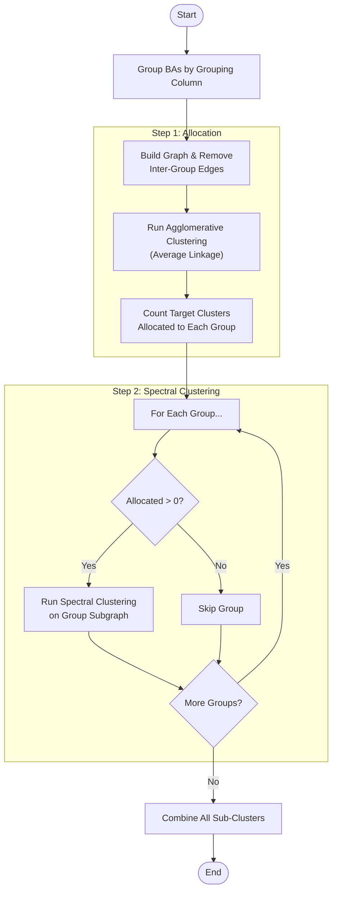
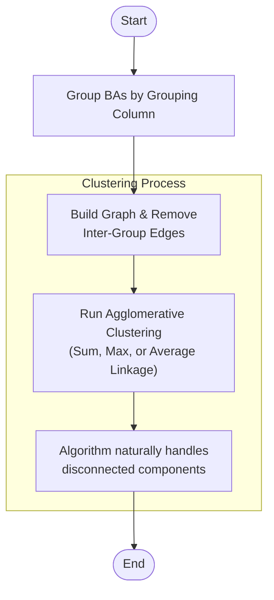

# Clustering Algorithms

The PowerGenome tools use several algorithms to aggregate Balancing Authorities (BAs) into model regions. The goal is to reduce the computational complexity of transmission modeling while preserving the most critical transmission constraints.

## Core Concepts

1. **Graph Construction**: A network graph is built where nodes are BAs and edges are weighted by the **firm transmission capacity** (MW) between them.
2. **Grouping Constraints**: Clustering respects the boundaries of the selected Grouping Column (e.g., NERC Region, State). BAs in different groups are generally not merged unless the algorithm is specifically configured to merge entire groups.

## Algorithms

### Spectral Clustering

**Spectral Clustering** is the default method. It uses the eigenvalues of the graph's Laplacian matrix to perform dimensionality reduction before clustering with K-Means.

* **Why it's used**: This method often produces balanced regions by finding "cuts" that minimize the ratio of cut weight to cluster volume.
* **Workflow**: When `Target Regions >= Number of Groups`, the algorithm uses a "Split-Apply-Combine" strategy to ensure disconnected groups are not mixed.

### Louvain Community Detection

**Louvain Community Detection** maximizes the **modularity** of the network.

* **Auto-optimize**: Can be used to find the "natural" number of regions where modularity is maximized.
* **Fixed Target**: Can be constrained to a fixed target number of regions (though less naturally than other methods).

### Hierarchical Clustering

**Hierarchical Clustering** builds a hierarchy of clusters. The tool supports three linkage criteria:

1. **Sum Linkage**: Merges clusters based on the **total** weight of edges between them. Tends to create a few very large central clusters ("snowballing").
2. **Average Linkage**: Merges based on the **average** weight of edges (Total Weight / (Size A * Size B)). This penalizes merging large clusters, leading to more even cluster sizes.
3. **Max Linkage**: Merges based on the **maximum** single edge weight between clusters (Single Linkage).

**Workflow**: When selected (and `Target Regions >= Number of Groups`), the algorithm runs on the full graph but respects group boundaries by removing edges between groups.

